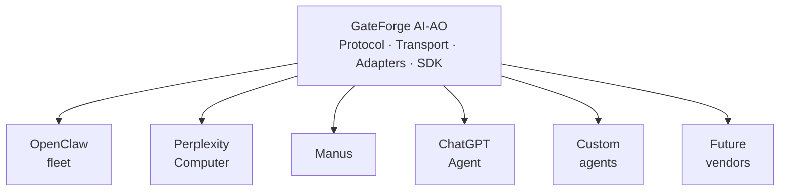
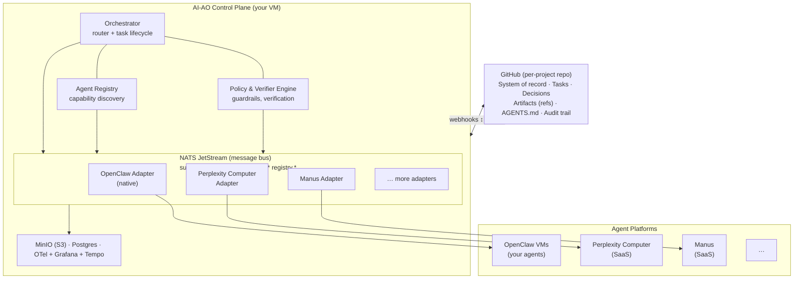

# GateForge AI-AO

> **Vendor-neutral, methodology-neutral orchestration framework for multi-agent, multi-platform AI workflows.**

[](./VERSION) [](#status) [](./LICENSE) [](./protocol/PROTOCOL-SPEC.md)

---

## What is GateForge AI-AO

**GateForge AI-AO** (Agent Orchestration) is a framework that lets AI agents from **different vendors and different platforms** coordinate on shared work. It provides a protocol, a transport substrate, and an adapter pattern — and nothing more. It does not impose a methodology. It does not privilege a vendor.

You bring the agents — OpenClaw, Perplexity Computer, Manus, ChatGPT Agent, custom in-house agents, future agents that don't exist yet. AI-AO gives them a common language, a shared event bus, a durable system of record, and an audit trail. They get a way to delegate tasks to each other, acknowledge each other in real time, and reconcile results — all without any one platform owning the orchestration layer.



---

## Why this exists

Most advanced users now run **more than one** AI agent platform. Each platform is good at different things, charges differently, has different latency profiles, and is reached through a different interface. There is no neutral way for them to coordinate.

The status quo is one of:
- **Manual copy-paste** between tabs (slow, error-prone, no audit trail)
- **One vendor's orchestration** (locks you into that vendor's ecosystem and roadmap)
- **Custom point-to-point integrations** (N×N integration cost, brittle, doesn't scale)

AI-AO replaces those with a single substrate where every agent is a peer behind a common protocol. Add a new agent → write one adapter. Swap your "prime" orchestrator → no other component changes. Audit a multi-agent run → one timeline, one trace ID, end to end.

---

## Three guarantees

1. **Vendor-neutral.** No platform is privileged in the protocol. OpenClaw, Perplexity Computer, Manus, and any future agent are all reached through symmetric adapters. The "prime AI" that drives orchestration is pluggable.
2. **Methodology-neutral.** AI-AO has no opinion about phases, roles, blueprints, or quality gates. It provides the primitives (tasks, events, capabilities, verification, audit). Methodologies — including the [GateForge Guideline](https://github.com/tonylnng/gateforge-openclaw-guideline) — layer on top.
3. **Event-driven, no polling.** Every state change is an event on a durable bus. Acknowledgements are immediate. No agent ever has to ask "is it done yet?"

---

## High-level architecture



**Three substrates, each doing what it's best at:**

| Substrate | Role | Why |
|-----------|------|-----|
| **GitHub** | Durable system of record | Already a versioned, auditable, ACL-aware shared brain. Humans and AI read from the same place. |
| **NATS JetStream** | Real-time nervous system | Sub-millisecond pub/sub, durable streams, consumer groups, request-reply, KV store. Single binary. |
| **MinIO (S3)** | Artifact store | Large outputs don't belong in Git. References live in Git, bytes live in S3. |

---

## Repository layout

```text
gateforge-ai-ao/
│
├── README.md                          # ← you are here
├── CONTRIBUTING.md                    # how to contribute, branching, schema rules
├── CHANGELOG.md                       # SemVer history
├── VERSION                            # current version
├── LICENSE
│
├── docs/                              # conceptual + architectural docs
│   ├── ARCHITECTURE.md                # full architecture deep-dive
│   ├── CONCEPTS.md                    # task envelopes, events, capabilities, etc.
│   ├── GLOSSARY.md                    # every term, defined once
│   ├── ROADMAP.md                     # phase-based build plan
│   ├── AGENT-NOTIFICATION.md          # how AI-AO notifies adapters/agents (no polling)
│   ├── ADMIN-PORTAL-UPGRADE.md        # upgrade plan for gateforge-admin-portal-site
│   ├── adr/                           # architecture decision records
│   └── diagrams/                      # source for diagrams (mermaid, drawio)
│
├── protocol/                          # THE WIRE-LEVEL SPEC (source of truth)
│   ├── PROTOCOL-SPEC.md               # human-readable spec
│   ├── SUBJECTS.md                    # NATS subject hierarchy reference
│   ├── ERROR-TAXONOMY.md              # error codes, semantics, retry policy
│   ├── WEBHOOK-SPEC.md                # standard webhook contract for adapters
│   ├── version.txt                    # protocol version this directory speaks
│   └── schema/                        # JSON Schema files
│       ├── task-envelope.v1.json
│       ├── event.v1.json
│       ├── agent-card.v1.json
│       └── error.v1.json
│
├── install/                           # ★ AI-OPERABLE SETUP GUIDES ★
│   ├── README.md                      # start here
│   ├── 00-prerequisites.md            # VM, Docker, network requirements
│   ├── 01-components.md               # what each component does and why
│   ├── 02-quickstart.md               # all-in-one docker-compose up
│   ├── 03-nats.md                     # NATS JetStream setup, streams, KV
│   ├── 04-minio.md                    # MinIO setup, buckets, lifecycle
│   ├── 05-postgres.md                 # Postgres setup, schemas, migrations
│   ├── 06-observability.md            # OTel + Tempo + Loki + Grafana
│   ├── 07-orchestrator.md             # orchestrator deployment
│   ├── 08-adapters.md                 # adapter deployment
│   ├── 09-github-app.md               # GitHub App for repo automation
│   ├── 10-security.md                 # mTLS, JWT, secret management
│   ├── 11-verification.md             # post-install smoke tests
│   └── runbooks/                      # operational runbooks
│
├── infrastructure/                    # ALL DOCKER-COMPOSE + CONFIGS
│   ├── docker-compose.yml             # the single all-in-one stack
│   ├── docker-compose.prod.yml        # production overrides
│   ├── .env.example                   # environment variables template
│   ├── nats/
│   ├── minio/
│   ├── postgres/
│   ├── observability/
│   └── policy/
│
├── orchestrator/                      # the "prime AI" router service
├── sdk/                               # SDKs for native agents (Go, TypeScript)
├── adapters/                          # one folder per adapter
│   ├── _scaffold/                     # template for new adapters
│   ├── openclaw/
│   ├── perplexity-computer/
│   └── manus/
├── tools/                             # CLI utilities (replay, trace, conformance)
│
└── .github/                           # workflows + issue templates
```

---

## Status

This repo is in **design phase**. The protocol spec, install guides, and infrastructure configs are being authored first; orchestrator and adapter implementations come after the protocol is locked at v1.0.

See [`docs/ROADMAP.md`](docs/ROADMAP.md) for the phase-by-phase build plan.

---

## Quick navigation

| If you want to… | Go to |
|------------------|-------|
| Understand the concepts | [`docs/CONCEPTS.md`](docs/CONCEPTS.md) |
| See the full architecture | [`docs/ARCHITECTURE.md`](docs/ARCHITECTURE.md) |
| Read the protocol spec | [`protocol/PROTOCOL-SPEC.md`](protocol/PROTOCOL-SPEC.md) |
| Set up a working stack | [`install/README.md`](install/README.md) |
| Write a new adapter | [`adapters/_scaffold/`](adapters/_scaffold/) |
| Look up a term | [`docs/GLOSSARY.md`](docs/GLOSSARY.md) |
| Understand how agents are notified | [`docs/AGENT-NOTIFICATION.md`](docs/AGENT-NOTIFICATION.md) |
| Upgrade the Admin Portal | [`docs/ADMIN-PORTAL-UPGRADE.md`](docs/ADMIN-PORTAL-UPGRADE.md) |

---

## Related projects

- **[gateforge-openclaw-guideline](https://github.com/tonylnng/gateforge-openclaw-guideline)** — the reference SDLC methodology that runs on AI-AO
- **[gateforge-admin-portal-site](https://github.com/tonylnng/gateforge-admin-portal-site)** — operational control plane and dashboard

AI-AO is independent of both; they are recommended companions, not requirements.

---

## License

Proprietary — GateForge Project. See [LICENSE](./LICENSE).
