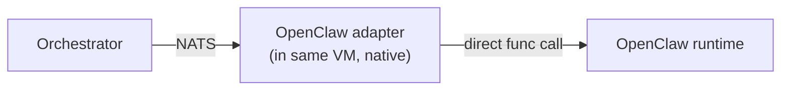

# Adapter — OpenClaw (Native NATS)

> **Class:** Native · **Status:** Reference adapter · **Language:** Go

OpenClaw is an in-house AI gateway framework (see [gateforge-openclaw-guideline](https://github.com/tonylnng/gateforge-openclaw-guideline)). Because we control the stack, this adapter speaks NATS directly — no HTTP shim, no browser automation. It is the **fastest path** for tasks that require deterministic, methodology-driven execution.

## Capabilities exposed

| Capability        | Notes                                                 |
| ----------------- | ----------------------------------------------------- |
| `system-design`   | Class A architecture per the OpenClaw Guideline       |
| `code-review`     | Static + heuristic + LLM-assisted                     |
| `research`        | Document/repo grounded; not general web search        |
| `artifact-generation` | Diagrams, ADRs, runbooks                          |

## How it differs from API/browser adapters



No outbound API calls. No browser. The adapter binary embeds (or links to) the OpenClaw runtime, so end-to-end latency is < 50 ms for task pickup.

## Configuration

| Env var                              | Purpose                                            |
| ------------------------------------ | -------------------------------------------------- |
| `ADAPTER_OPENCLAW_HTTP_PORT`         | Health/metrics port (default 8203)                 |
| `ADAPTER_OPENCLAW_GUIDELINE_REPO`    | Git URL for the OpenClaw Guideline (rules source)  |

## Deploy

```bash
docker compose --profile openclaw up -d adapter-openclaw
```

## Implementation status

Phase 5 deliverable. Until then, this adapter ships as a stub that completes the conformance suite by echoing input.

## Relationship to the Guideline

The OpenClaw Guideline repo defines **how** OpenClaw works internally (Class A/B/C separation, multi-agent vs single-agent variants). AI-AO does not care about that internal structure — from AI-AO's perspective, OpenClaw is a black box that exposes capabilities. This separation is what makes AI-AO methodology-neutral.
