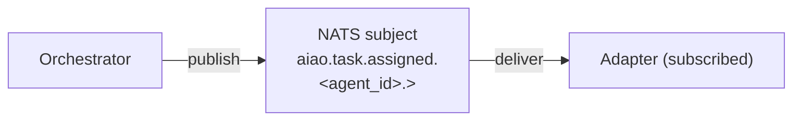

# How AI-AO Notifies Agents

> **Question:** How does GateForge AI-AO actively notify Manus or Perplexity Computer to follow up on tasks?
>
> **Short answer:** AI-AO never talks to an agent directly. It publishes to NATS; the **adapter** is the only piece that knows the agent exists. This is what makes the framework vendor-neutral and event-driven (no polling) end-to-end.

This document is the canonical reference for the notification mechanism. See also:
- [`ARCHITECTURE.md`](ARCHITECTURE.md) — overall layering
- [`../protocol/SUBJECTS.md`](../protocol/SUBJECTS.md) — subject taxonomy
- [`../protocol/WEBHOOK-SPEC.md`](../protocol/WEBHOOK-SPEC.md) — webhook contract
- [`../adapters/_scaffold/README.md`](../adapters/_scaffold/README.md) — three adapter classes

---

## The general pattern

AI-AO never "notifies" agents directly. Instead:



The **adapter** is the bridge. It holds a long-lived NATS subscription (durable consumer) and translates incoming task envelopes into whatever the underlying agent speaks — API call, browser action, native function call.

So "AI-AO notifies Manus/Perplexity" really means **"the adapter receives a NATS message and acts on it."**

---

## Perplexity Computer — API-based adapter

```mermaid
sequenceDiagram
    participant Orchestrator
    participant NATS as NATS JetStream\n(durable consumer)
    participant Adapter as adapter-pplx (TS)\n• ack ≤ 100ms\n• emit "started"
    participant API as Perplexity API\nreturns task_id
    participant Webhook as adapter-pplx\n/webhook/pplx\nHMAC verified
    participant NATSOut as NATS publish\naiao.event.\ncompleted.&lt;id&gt;

    Orchestrator->>NATS: 1. publish\naiao.task.assigned.pplx/v1.&lt;id&gt;
    NATS->>Adapter: 2. deliver
    Adapter->>API: 3. HTTPS POST /tasks
    API->>Webhook: 4. webhook
    Webhook->>NATSOut: 5. translate to event
```

**Outbound (orchestrator → Computer):** the adapter calls the Perplexity API. That's a simple HTTPS request triggered by the NATS delivery — no polling.

**Inbound (Computer → orchestrator):** the adapter exposes a webhook endpoint (`/webhook/pplx`). Computer calls it on progress and completion. The adapter HMAC-verifies the request, then publishes an `aiao.event.*` message. Cost and tokens are extracted from the webhook payload.

If the agent doesn't support webhooks for some operation, the adapter uses **streaming** — open the HTTP connection once, read server-sent events as they arrive, translate each into a NATS event. Still no polling.

---

## Manus — browser-based adapter

Manus has no API, so the adapter pretends to be a human:

```mermaid
sequenceDiagram
    participant Orchestrator
    participant NATS as NATS JetStream
    participant Adapter as adapter-manus (TS)\n• ack ≤ 100ms\n• leases a browser
    participant Browser as Headless Chromium\n• storageState\n• navigate, type\n• submit form
    participant DOM as adapter-manus\n• detect "done"\n• screenshot→S3\n• extract output
    participant NATSOut as NATS event\naiao.event.\ncompleted.&lt;id&gt;

    Orchestrator->>NATS: 1. publish\naiao.task.assigned.manus/v1.&lt;id&gt;
    NATS->>Adapter: 2. deliver
    Adapter->>Browser: 3. Playwright actions
    Browser->>DOM: 4. listen for DOM events\n(MutationObserver / waitForSelector)
    DOM->>NATSOut: 5. publish
```

**Outbound:** the adapter drives Chromium via Playwright — clicks, types, submits.

**Inbound:** Playwright's `waitForSelector` / `page.on('response')` / MutationObserver detect when Manus has finished a turn. That's still **event-driven** — Playwright's primitives are notification-based, not polling. The adapter never asks "is it done yet?" on a timer.

---

## The four notification mechanisms

| Mechanism | Used by | Notification source |
| --- | --- | --- |
| **NATS push** | Orchestrator → Adapter (always) | JetStream durable consumer |
| **Webhook** | Adapter ← Perplexity Computer | HMAC-signed POST |
| **HTTP streaming (SSE/chunked)** | Adapter ← any API agent that supports it | Open connection, server pushes |
| **Browser DOM events** | Adapter ← Manus | Playwright `waitForSelector` / `page.on()` |

In all four cases the receiving side is **passive until a real event arrives**. Nothing is polled.

---

## What the orchestrator actually publishes

When you submit a task, the orchestrator's router picks an agent from `policy.yaml`, then publishes to a subject like:

```
aiao.task.assigned.perplexity-computer/v1.7f3a2b1c-...
```

The adapter has a durable consumer with `filter_subject: "aiao.task.assigned.perplexity-computer/v1.>"` — JetStream pushes the message the moment it's published. Acknowledgement is required within `ack_wait` (30s default) or it redelivers. That's how AI-AO guarantees **at-least-once** delivery without losing tasks if the adapter restarts.

---

## The follow-up flow (cancel, redirect, approve)

Same pattern for control actions. If an operator cancels a running task from the Admin Portal:

```
Operator → Portal → POST /v1/tasks/<id>:cancel → Orchestrator
   → publish aiao.control.cancel.<agent_id>.<task_id>
   → adapter has a second subscription on aiao.control.>
   → adapter aborts the in-flight HTTP / Playwright operation
   → emits aiao.event.cancelled.<id>
```

The orchestrator never reaches into the agent. It publishes a control event, and the adapter — which already has a live NATS subscription — translates it into the right vendor-specific abort call.

---

## Why this design holds the three guarantees

| Guarantee | How notification design supports it |
| --- | --- |
| **Vendor-neutral** | Only the adapter knows the vendor; the orchestrator only knows NATS subjects. Swapping vendors means swapping an adapter. |
| **Methodology-neutral** | Subjects use methodology-neutral capabilities (`research`, `code-review`); the agent's internal "role" is invisible to AI-AO. |
| **Event-driven, no polling** | Every hop in the diagrams above is push-based: NATS push, webhooks, HTTP streaming, or DOM events. There is no `setInterval` anywhere in the critical path. |
