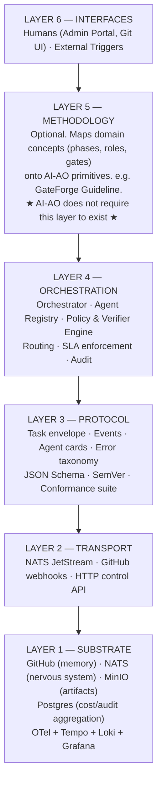
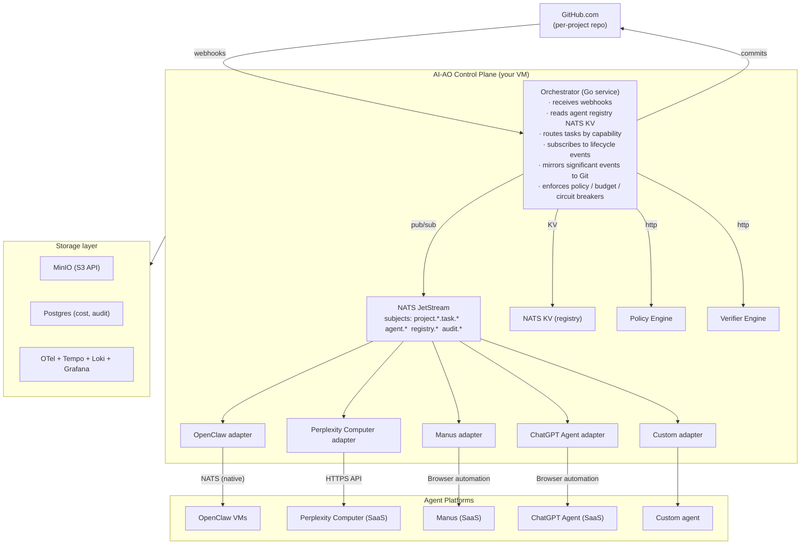
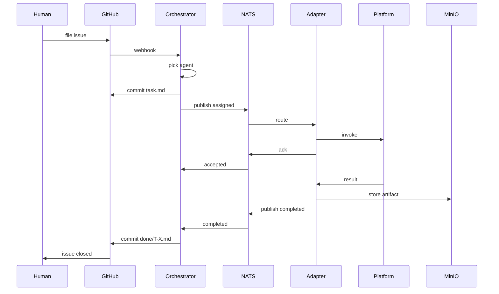
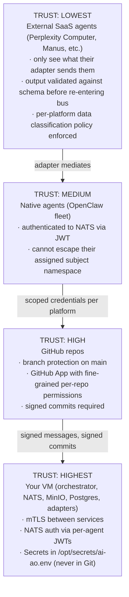

# Architecture

This document explains the architecture of GateForge AI-AO in depth. For a higher-level overview, see [`README.md`](../README.md). For concept definitions, see [`CONCEPTS.md`](CONCEPTS.md). For the specific question of **how AI-AO notifies agents like Manus or Perplexity Computer**, see [`AGENT-NOTIFICATION.md`](AGENT-NOTIFICATION.md).

---

## Layered view

Lower layers are stable. Higher layers iterate freely. The protocol (Layer 3) is the contract between the lower stack (everyone implements) and the higher stack (everyone consumes).

---

## Component diagram

All adapter services and storage components run on **your VM** (single-VM dev) or across a small fleet (production). See [`install/`](../install/) for sizing.

---

## Data flow: a task in motion

Every arrow is durable, traced, and audited. The bus carries the live signal; Git carries the durable record; MinIO carries the bytes.

---

## Why three substrates instead of one

Other multi-agent designs typically pick one storage layer and force everything through it. Each choice has a failure mode:

| If you only used… | What breaks |
|-------------------|-------------|
| **Just Git** | Real-time coordination is too slow; no consumer groups; no streaming progress |
| **Just NATS** | No human-readable audit; no version history; no shared world model |
| **Just a database** | No human-AI shared interface; you reinvent issue tracking, file diffs, ACLs |
| **Just S3** | No event semantics; no routing; no audit trail |

Three substrates, each playing to its strengths, costs only modest operational complexity (one extra binary or two) and unlocks order-of-magnitude better behaviour on the dimensions that matter for production multi-agent work.

---

## Trust boundaries

External agents are never trusted directly. Every output crossing back into the trusted core is schema-validated, sanitized, and tagged with provenance.

---

## Failure model

The system is designed to **fail open with audit**, not fail silent.

| Failure | Detection | Recovery |
|---------|-----------|----------|
| Adapter crashes mid-task | NATS heartbeat missed, JetStream redelivery | Same adapter restarts, sees task_id in seen-set, resumes via platform API or re-runs idempotently |
| NATS broker dies | All adapters reconnect on backoff; orchestrator switches to readonly Git mode | Cluster mode in production (3 nodes); single-node dev tolerates restart |
| GitHub webhook missed | 60s reconciliation loop diffs Git state vs NATS KV | Drift detected, missing events synthesized |
| Platform timeout | Adapter SLA timer fires | Task marked failed with `error.timeout`, retry policy applies |
| Verification failure | Verifier publishes `task.failed` with reason | Original task fails, escalation policy fires |
| Cost circuit breaker trips | Policy engine sees daily spend > cap | New tasks rejected with `error.budget_exceeded`; in-flight tasks complete |
| Poison message | JetStream max-deliver exceeded | Routed to DLQ subject, alert fires, manual replay via `tools/replay-cli` |

---

## Scaling model

| Stage | Configuration | Throughput target |
|-------|---------------|-------------------|
| **Dev / personal** | Single VM, all components co-located | ~100 tasks/day, ~5 concurrent |
| **Small team** | Single VM (8c/16GB), tuned | ~10k tasks/day, ~50 concurrent |
| **Production** | 3-node NATS cluster, dedicated MinIO, separate orchestrator and adapter VMs | ~1M tasks/day, ~1000 concurrent |
| **Multi-tenant** | Add per-tenant subject prefix and JWT scopes; horizontal adapters | Scale linearly with adapter count |

Adapters scale horizontally via NATS consumer groups: spin up N instances of the same adapter, NATS distributes work automatically. The orchestrator scales vertically first, then can be sharded by project.

---

## Observability

Every interaction generates:

1. **An OTel trace span** (with parent span propagated via NATS message headers)
2. **A structured log line** (Loki)
3. **A metric** (Prometheus, scraped by Grafana)
4. **An event** (NATS audit firehose, mirrored to Git for projects with audit retention)

The result: you can pick any `task_id` and reconstruct the exact sequence — which agent did what, when, with what cost, with what input and output, in milliseconds.

See [`install/06-observability.md`](../install/06-observability.md) for the stack.

---

## Where to go next

- [`CONCEPTS.md`](CONCEPTS.md) — define every concept
- [`../protocol/PROTOCOL-SPEC.md`](../protocol/PROTOCOL-SPEC.md) — the wire-level contract
- [`../install/`](../install/) — build the stack
- [`ROADMAP.md`](ROADMAP.md) — phase-by-phase build plan
- [`adr/`](adr/) — architectural decisions and their rationale
