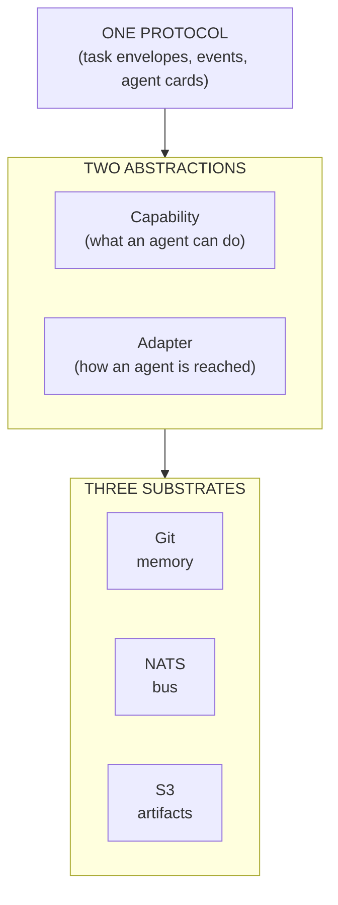
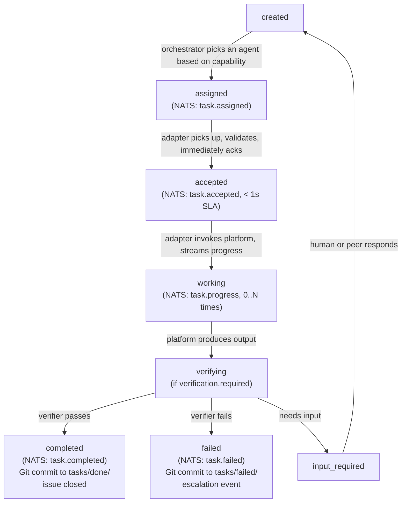

# Core Concepts

This document defines every concept in GateForge AI-AO. If you read only one doc to understand the system, read this one.

---

## The mental model

AI-AO has **three substrates**, **two abstractions**, and **one protocol**.



---

## The three substrates

### Git (GitHub) — the memory

Per-project GitHub repo. Stores:

- **Project context** (`README.md`, `AGENTS.md`)
- **Tasks as files** (`tasks/open/<id>.md`, `tasks/done/<id>.md`)
- **Decisions** (`decisions/NNNN-*.md`)
- **Artifact references** (URIs pointing into MinIO, with hashes)
- **Audit trail** (every state change is a commit)

Why Git: durable, versioned, signable, ACL-aware, human-readable. Already a shared world model that humans and AI both understand. We don't reinvent it.

### NATS JetStream — the nervous system

Single-binary message broker. Carries:

- **Task assignments** (orchestrator → adapter)
- **Acknowledgements** (adapter → orchestrator, immediate)
- **Progress events** (adapter → subscribers, streaming)
- **Lifecycle events** (completed, failed, cancelled)
- **Heartbeats** (every agent, every 10s)
- **Capability discovery** (registry queries)

Why NATS: sub-millisecond latency, durable streams (replay), consumer groups (horizontal scaling), KV store (live registry), request-reply with correlation IDs (synchronous-feel without synchronous coupling). Single binary, easy to operate.

### MinIO (S3) — the artifact store

Self-hosted S3-compatible object store. Carries:

- **Large outputs** (PDFs, screenshots, datasets, reports)
- **Anything that doesn't belong in Git history**

Git stores the **reference**; MinIO stores the **bytes**.

```yaml
# Example reference in tasks/open/T-0042.md
artifacts:
  - name: research-report.pdf
    uri: s3://gateforge-artifacts/proj-travel/T-0042/research-report.pdf
    sha256: e3b0c44298fc1c149afbf4c8996fb924...
    size: 2456789
    produced_by: perplexity-computer
```

---

## The two abstractions

### Capability

A **capability** is a generic verb describing what an agent can do. Examples:

- `research` — gather information from external sources
- `web-browsing` — drive a browser to perform tasks
- `system-design` — produce architecture documents
- `code-review` — review code for quality, security, correctness
- `fact-check` — verify claims against authoritative sources
- `document-generation` — produce structured documents

Capabilities are **methodology-neutral on purpose**. AI-AO does not know what "Architect" means or what "Phase 2" is. A methodology (like the [GateForge Guideline](https://github.com/tonylnng/gateforge-openclaw-guideline)) maps its own concepts onto AI-AO capabilities — for example, "the Architect role consumes `system-design` and `requirements-analysis` capabilities."

Routing decisions are made on capabilities: "this task needs `research`; route to any agent that advertises `research`."

### Adapter

An **adapter** is a small service that lets AI-AO talk to a specific agent platform. There are three classes:

| Adapter class | When to use | Example |
|---------------|-------------|---------|
| **Native** | The agent platform speaks the AI-AO SDK directly | OpenClaw VMs |
| **API-based** | Platform exposes an HTTP API | Perplexity Computer (where API exists) |
| **Browser-based** | Platform is UI-only, reached via browser automation | Manus, ChatGPT Agent |

Adapters are **stateless** and **uniform** from the protocol's perspective. The bus and Git see only standard envelopes; platform-specific quirks live entirely inside the adapter.

---

## The one protocol

The protocol defines four object types:

### Task envelope

The unit of delegated work. See [`protocol/PROTOCOL-SPEC.md`](../protocol/PROTOCOL-SPEC.md) for the full schema. Key fields:

| Field | Purpose |
|-------|---------|
| `task_id` | Unique ID (UUIDv7), idempotency key |
| `trace_id` | Distributed trace ID, propagated across all hops |
| `parent_task_id` | If this task was spawned by another, its ID |
| `goal` | Plain-English description of what to do |
| `success_criteria` | Bullet list of conditions for "done" |
| `deliverable_type` | What kind of output is expected |
| `context_refs` | Git URIs the receiver must read first |
| `constraints` | Budget, deadline, autonomy, data classification |
| `verification` | Whether and how to verify the output |
| `callback` | Where to publish events and commit results |

### Event

A lifecycle update on a task. See [`protocol/PROTOCOL-SPEC.md`](../protocol/PROTOCOL-SPEC.md). Event types:

- `task.assigned` — orchestrator → adapter
- `task.accepted` — adapter → orchestrator (immediate ack)
- `task.rejected` — adapter cannot accept
- `task.progress` — incremental update during work
- `task.completed` — terminal success
- `task.failed` — terminal failure
- `task.cancelled` — terminal cancellation
- `task.input_required` — agent needs human or peer input

### Agent card

A self-describing manifest for an agent. Lives in NATS KV (live) and is mirrored to `AGENTS.md` (declarative). Declares capabilities, cost profile, reliability metrics, endpoint, constraints, and protocol version spoken.

### Error

A structured error with code, retryability, and remediation hint. See [`protocol/ERROR-TAXONOMY.md`](../protocol/ERROR-TAXONOMY.md).

---

## Core principles

### 1. Stateless agents

Agents derive all their context from Git + the task envelope's `context_refs`. They do not maintain hidden state between tasks. **You can swap agent instances at any time** without losing project knowledge — the new instance reads Git and is up to speed.

This is the same principle that makes Kubernetes work: declarative state in etcd, controllers reconcile reality. Here: declarative state in Git, agents reconcile by reading and committing.

### 2. Event-driven, no polling

No agent ever asks "is task X done?". When something happens, an event fires. Subscribers react. The orchestrator subscribes to terminal events for tasks it cares about. Humans see live updates via the Admin Portal subscribing to the same bus.

### 3. Idempotent everywhere

Every task has a UUID. Every adapter checks "have I seen this task_id before?" before acting. Every event carries a UUID. Duplicates are detected and dropped. Required because no broker offers true exactly-once.

### 4. Methodology-neutral protocol

AI-AO has no opinion about phases, roles, or quality gates. Methodologies layer on top via the `metadata` extension namespace and capability mapping.

### 5. Vendor-neutral routing

The orchestrator routes by capability, not by vendor name. If three agents advertise `research`, the orchestrator picks based on cost, reliability, and current load — not on which platform they run on.

### 6. Audit by construction

Every event is durable in NATS streams. Every significant state change is mirrored to Git. Every action carries a `trace_id`. Reconstructing what happened during a multi-agent run is a query, not an investigation.

---

## Lifecycle of a task

A task's full lifecycle, end to end:



Every transition emits an event. Every event is durable. Every event carries the same `task_id` and `trace_id`. The full lifecycle is reconstructable from the event log alone.

---

## Three flows that show how it all fits

### Flow 1: Single-agent task

You file an issue: "Research best Southeast Asia destinations for October."

1. GitHub fires a webhook to orchestrator
2. Orchestrator reads `AGENTS.md`, picks `perplexity-computer-prod` (advertises `research`)
3. Orchestrator writes `tasks/open/T-0042.md`, publishes envelope to `project.travel.task.T-0042.assigned`
4. Perplexity Computer adapter is subscribed → receives → publishes `task.accepted` immediately
5. Adapter invokes Perplexity Computer via API
6. Adapter publishes `task.progress` events as work streams in
7. Result lands → adapter writes PDF to MinIO, commits reference to repo, publishes `task.completed`
8. Orchestrator (subscribed to completion) closes the issue, links artifacts

### Flow 2: Multi-agent task with verification

You file: "Design the resilience strategy for our payment service."

1. Orchestrator routes to `openclaw-architect` (advertises `system-design`)
2. Architect produces design doc → publishes `task.completed`
3. Orchestrator sees `verification.required: true`, spawns child task with `fact-check` + `code-review` capabilities
4. Two verifier agents (could be different vendors) review independently
5. Both pass → original task marked `completed`
6. One fails → original task transitions to `failed` with reason; orchestrator may auto-retry or escalate per policy

### Flow 3: Cross-vendor delegation

OpenClaw architect agent realizes it needs deep web research it can't do well.

1. Architect publishes a child task with `parent_task_id` set, `capability: research`
2. Orchestrator routes to Perplexity Computer (best `research` performer)
3. Perplexity Computer does the work → result lands in Git
4. Architect (subscribed to its child tasks) sees completion, incorporates result, continues its own work

The architect doesn't know "Perplexity Computer" exists. It asked for a capability; the orchestrator chose the best provider.

---

## What AI-AO is not

- **Not a methodology.** It does not tell you how to build software. The [GateForge Guideline](https://github.com/tonylnng/gateforge-openclaw-guideline) does that, layered on top.
- **Not an agent.** It does not produce content. It coordinates the agents that do.
- **Not a vendor.** It does not run inference. It routes, tracks, and audits.
- **Not a chat product.** It is infrastructure.

---

## Where to go next

- Full architecture: [`docs/ARCHITECTURE.md`](ARCHITECTURE.md)
- Protocol spec: [`protocol/PROTOCOL-SPEC.md`](../protocol/PROTOCOL-SPEC.md)
- Setup: [`install/README.md`](../install/README.md)
- Glossary: [`docs/GLOSSARY.md`](GLOSSARY.md)
