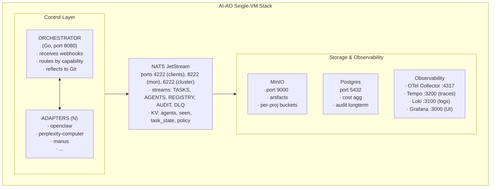
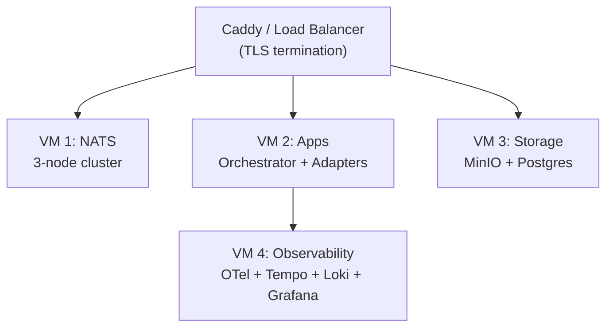

# 01 — Components: what each one is and why

Read this **before** running anything. If you skip ahead to install commands, you will not understand what you are installing.

---

## The full stack

All services are Docker containers, orchestrated by `docker compose` from `infrastructure/docker-compose.yml`.

---

## Component-by-component

### NATS JetStream

**Image:** `nats:2.10.20-alpine` (~20 MB)
**Why:** AI-AO's nervous system. Every event between agents flows through NATS subjects. JetStream gives durable streams (so events survive restarts and can be replayed), consumer groups (so adapters scale horizontally), KV store (the live agent registry), and request-reply with correlation IDs (synchronous-feel without synchronous coupling).
**Why not Kafka/RabbitMQ/Redis Streams:** NATS is a single binary, sub-millisecond latency, easier to operate, has the right primitives natively. See [`docs/adr/0001-three-substrates.md`](../docs/adr/0001-three-substrates.md).
**Config lives in:** `infrastructure/nats/nats-server.conf`, `infrastructure/nats/jetstream-streams.yaml`
**Detail guide:** [`03-nats.md`](03-nats.md)

### MinIO

**Image:** `minio/minio:RELEASE.2025-01-20T14-49-07Z`
**Why:** S3-compatible object store for artifacts (PDFs, screenshots, large outputs). Bytes go here; references go in Git. Self-hosted means no cloud bill and full control over retention.
**Why not Git LFS:** LFS is awkward, slow on large files, and doesn't have lifecycle policies. S3 is the right shape for this data.
**Config lives in:** `infrastructure/minio/`, lifecycle rules in `infrastructure/minio/lifecycle.json`
**Detail guide:** [`04-minio.md`](04-minio.md)

### Postgres

**Image:** `postgres:16.6-alpine`
**Why:** Cost aggregation, long-term audit aggregation, and operational reporting. A relational database is the right tool for "give me total spend last 30 days grouped by project and agent." Postgres is **not** the system of record — Git is. Postgres holds queries that Git can't answer efficiently.
**What lives here:**
- `cost_events` — every cost emission, indexed by task, project, agent, day
- `audit_aggregates` — denormalized summaries of NATS audit firehose
- `policy_state` — current policy snapshot for fast reads
**Detail guide:** [`05-postgres.md`](05-postgres.md)

### OpenTelemetry Collector

**Image:** `otel/opentelemetry-collector-contrib:0.115.0`
**Why:** Receives traces, metrics, and logs from every component (orchestrator, adapters, NATS, MinIO). Forwards traces to Tempo, logs to Loki, metrics to Prometheus (built into Grafana). Central pipeline = consistent telemetry shape.
**Config lives in:** `infrastructure/observability/otel-collector.yaml`
**Detail guide:** [`06-observability.md`](06-observability.md)

### Tempo

**Image:** `grafana/tempo:2.6.1`
**Why:** Distributed trace storage. Pick any `task_id` or `trace_id`, see the full multi-hop journey across orchestrator, NATS, adapter, vendor API, MinIO, and back. The single most useful debugging tool in a distributed system.

### Loki

**Image:** `grafana/loki:3.3.2`
**Why:** Log aggregation across all containers. Search by label, time range, content. Replaces "ssh into 5 boxes and tail logs."

### Grafana

**Image:** `grafana/grafana:11.4.0`
**Why:** UI for Tempo + Loki + Prometheus. Dashboards in `infrastructure/observability/grafana-dashboards/` are loaded automatically. Cost dashboard, SLA dashboard, agent fleet dashboard, trace explorer.

### Orchestrator

**Image:** built from `orchestrator/` (Go, ~30 MB binary)
**Why:** The "prime AI" router. Receives GitHub webhooks, picks an agent based on capability and policy, publishes the task to NATS, watches for completion, mirrors significant events back to Git. **Stateless** — derives all state from Git + NATS KV. Restart anytime. Pluggable — swap implementations without touching anything else.
**Detail guide:** [`07-orchestrator.md`](07-orchestrator.md)

### Adapters

**Image:** built from `adapters/<name>/`
**Why:** One per agent platform. Each translates between AI-AO's protocol and the platform's native interface. Stateless. Three classes:
- **Native** (e.g. OpenClaw): platform speaks AI-AO SDK directly via NATS
- **API-based** (e.g. Perplexity Computer): adapter calls the platform's HTTP API
- **Browser-based** (e.g. Manus): adapter drives a browser via Playwright
**Detail guide:** [`08-adapters.md`](08-adapters.md)

---

## Production layout (when you outgrow single-VM)

The `docker-compose.yml` in this repo defaults to single-VM. The `docker-compose.prod.yml` overrides for multi-VM. Both are kept in sync.

---

## Image and version pinning

All images in this repo are pinned to specific tags. We do **not** use `:latest`. To upgrade an image:

1. Update the tag in `infrastructure/docker-compose.yml`
2. Run the full conformance suite (`tools/conformance-test/`)
3. Add a CHANGELOG entry under "infra"
4. Open a PR

Why pin: reproducibility. Drift is the #1 source of "it worked yesterday."

---

## Next: the quickstart

Once you understand what you're installing, head to [`02-quickstart.md`](02-quickstart.md) and bring the stack up.
