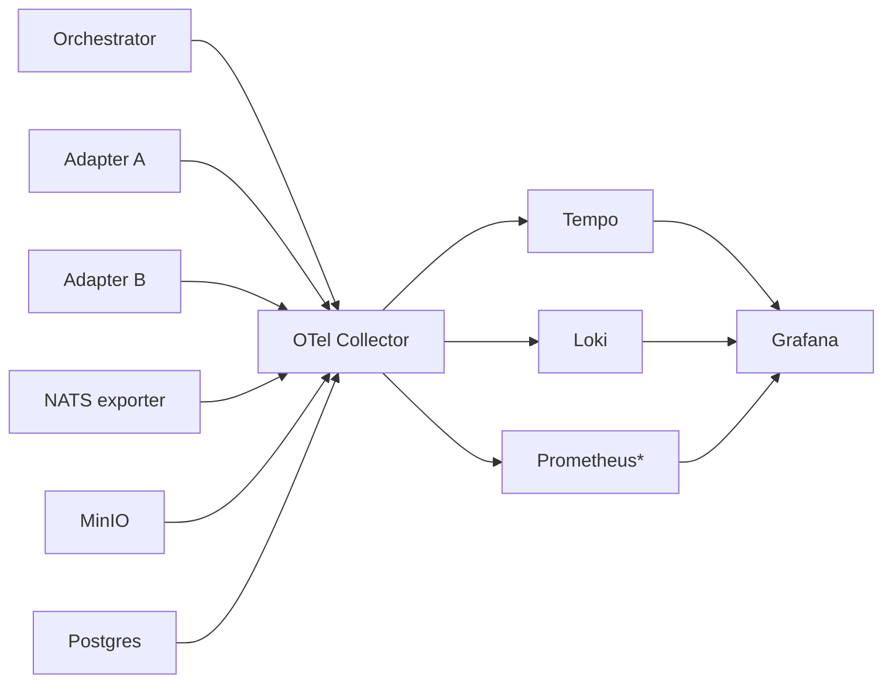

# 06 — Observability: OpenTelemetry + Tempo + Loki + Grafana

The single most useful debugging surface in a distributed system. Set this up early — it pays for itself the first time something goes wrong.

---

## What's deployed

| Component | Image | Port | Role |
|-----------|-------|-----:|------|
| OTel Collector | `otel/opentelemetry-collector-contrib:0.115.0` | 4317 (gRPC), 4318 (HTTP) | Receives traces/metrics/logs from all services |
| Tempo | `grafana/tempo:2.6.1` | 3200 | Distributed trace storage |
| Loki | `grafana/loki:3.3.2` | 3100 | Log storage |
| Grafana | `grafana/grafana:11.4.0` | 3000 | UI for everything |

---

## Architecture



> \* Prometheus is built into Grafana via the embedded scraper for our scale. At larger scale, run a standalone Prometheus.

Every AI-AO service exports OTLP. NATS metrics are scraped via `nats-exporter`. MinIO and Postgres metrics are scraped via their built-in endpoints.

---

## OTel Collector

`infrastructure/observability/otel-collector.yaml`:

```yaml
receivers:
  otlp:
    protocols:
      grpc:
        endpoint: 0.0.0.0:4317
      http:
        endpoint: 0.0.0.0:4318

  prometheus:
    config:
      scrape_configs:
        - job_name: 'nats'
          static_configs:
            - targets: ['nats-exporter:7777']
        - job_name: 'minio'
          metrics_path: /minio/v2/metrics/cluster
          bearer_token_file: /etc/otel/minio-token
          static_configs:
            - targets: ['minio:9000']
        - job_name: 'postgres'
          static_configs:
            - targets: ['postgres-exporter:9187']

processors:
  batch:
    timeout: 5s
  resource:
    attributes:
      - key: deployment.environment
        value: ${env:DEPLOY_ENV}
        action: insert

exporters:
  otlp/tempo:
    endpoint: tempo:4317
    tls: { insecure: true }
  loki:
    endpoint: http://loki:3100/loki/api/v1/push

service:
  pipelines:
    traces:
      receivers: [otlp]
      processors: [batch, resource]
      exporters: [otlp/tempo]
    logs:
      receivers: [otlp]
      processors: [batch, resource]
      exporters: [loki]
    metrics:
      receivers: [otlp, prometheus]
      processors: [batch, resource]
      exporters: [otlp/tempo]   # Tempo also stores some service metrics
```

---

## Trace context propagation

Every NATS message header carries OTel trace context:

```
header: traceparent: 00-<trace_id>-<span_id>-<flags>
header: tracestate: <vendor-specific>
```

The Go SDK and TypeScript SDK both inject and extract this automatically. Adapters that don't use the SDK MUST do this manually — see [`adapters/_scaffold/`](../adapters/_scaffold/).

GitHub commits made by the orchestrator include `Trace-Id: <trace_id>` in the commit message footer for cross-substrate correlation.

---

## Pre-loaded Grafana dashboards

`infrastructure/observability/grafana-dashboards/` contains:

| Dashboard | Purpose |
|-----------|---------|
| `ai-ao-overview.json` | Single-pane fleet view (tasks/min, p95 latency, error rate, active agents) |
| `ai-ao-cost.json` | Cost per project, agent, day with budget burn-down |
| `ai-ao-agents.json` | Per-agent reliability, latency, queue depth |
| `ai-ao-traces.json` | Trace explorer with task_id quick filter |
| `ai-ao-failures.json` | DLQ depth, error code distribution, top failing platforms |

Loaded automatically on Grafana startup via `infrastructure/observability/grafana-provisioning/`.

---

## Useful trace queries (Tempo)

In Grafana → Explore → Tempo:

```
# Find traces for a specific task
{ ai_ao.task_id = "01HXYZAB..." }

# Find slow traces
{ duration > 30s and ai_ao.task_id != "" }

# Failures in the last hour
{ status = error and resource.service.name = "orchestrator" }

# Trace from a specific agent
{ ai_ao.agent_id = "perplexity-computer-prod" }
```

---

## Useful log queries (Loki)

```
# All logs for a task
{ai_ao_task_id="01HXYZAB..."}

# Errors from the orchestrator in the last 15m
{service="orchestrator"} |= "ERROR" |~ "task.*failed"

# Adapter retry events
{service=~"adapter-.+"} |~ "retry attempt"
```

---

## Alerting

Define rules in `infrastructure/observability/grafana-alerts/`:

| Alert | Condition | Severity |
|-------|-----------|----------|
| `dlq_depth_high` | `DLQ` stream has > 10 messages | major |
| `cost_burn_high` | Daily project spend > 90% of budget | major |
| `agent_unhealthy` | Agent missing heartbeat > 60s | minor |
| `circuit_breaker_open` | Any breaker open | major |
| `task_p95_latency_high` | p95 task latency > 2× rolling-24h baseline | minor |

Notification channels (Slack, email, PagerDuty) configured in `.env`.

---

## Verification

```bash
# All four services up
docker compose ps | grep -E 'otel|tempo|loki|grafana'
# All show 'healthy'

# Grafana reachable
curl -s -o /dev/null -w "%{http_code}\n" http://localhost:3000  # 302

# OTel ingest reachable
nc -zv localhost 4317  # connected
nc -zv localhost 4318  # connected

# Send a test trace via OTLP HTTP
curl -X POST http://localhost:4318/v1/traces \
  -H "Content-Type: application/json" \
  -d @<(cat <<EOF
{"resourceSpans":[{"resource":{"attributes":[{"key":"service.name","value":{"stringValue":"smoke-test"}}]},"scopeSpans":[{"spans":[{"traceId":"5b8aa5a2d2c872e8321cf37308d69df2","spanId":"051581bf3cb55c13","name":"test","startTimeUnixNano":"$(date +%s%N)","endTimeUnixNano":"$(date +%s%N)"}]}]}]}
EOF
)
# Expect 200 OK

# Then in Grafana → Explore → Tempo, search trace_id 5b8aa5a2d2c872e8321cf37308d69df2
```

---

## Common issues

| Symptom | Cause | Fix |
|---------|-------|-----|
| Grafana login fails | Wrong `GRAFANA_ADMIN_PASSWORD` | Reset via env, restart container |
| No traces appearing | OTel Collector misconfigured or service not exporting | Check OTel logs; verify env `OTEL_EXPORTER_OTLP_ENDPOINT` on the service |
| Loki disk fills | Retention too long | Tune `loki/loki.yaml` retention period |
| Dashboards empty | Datasource provisioning failed | Check `grafana-provisioning/` mount; restart Grafana |
