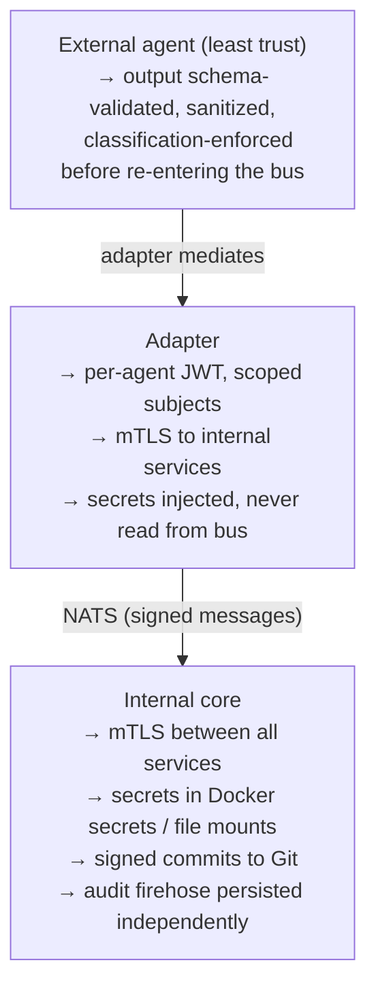

# 10 — Security

What to harden before exposing AI-AO to anything other than your laptop.

---

## Threat model

AI-AO mediates between trusted internal services (orchestrator, native adapters, NATS, MinIO, Postgres) and untrusted external services (closed-platform agents, the internet at large). The threats:

| Threat | Mitigation |
|--------|-----------|
| Compromised external agent returns malicious output | Schema validation + sanitization on every adapter→bus path |
| Stolen adapter credential | Per-agent JWT, short TTL, scoped subjects |
| MITM between services | mTLS within the cluster |
| Compromised orchestrator | Signed commits, append-only audit, breach contained per project |
| Compromised GitHub App key | Rotate key (one command), App scoped to specific repos |
| Data exfiltration via classification mismatch | `data_classification` enforcement; agents declare what they accept |
| Replay attacks on bus | Idempotency seen-set (24h) + signed messages |

---

## Layered controls



---

## NATS auth (production)

Switch from bootstrap-password mode to NKEY+JWT mode.

### 1. Generate operator and account NKEYs

```bash
docker run --rm -v $PWD/nats-keys:/nsc natsio/nats-box \
  nsc init --name ai-ao --dir /nsc

# Inside the container:
# This creates an Operator JWT, Account JWT, Account NKEY, signing keys
```

### 2. Create per-agent users

```bash
nsc add user --account AI_AO --name perplexity-computer-prod \
  --allow-pub "agent.perplexity-computer-prod.>,project.*.task.*.{accepted,rejected,progress,completed,failed,input_required}" \
  --allow-sub "agent.perplexity-computer-prod.inbox,agent.perplexity-computer-prod.control,project.*.task.*.assigned" \
  --expiry 720h    # 30-day validity
```

### 3. Distribute the user JWT to the adapter

```bash
nsc generate creds --account AI_AO --name perplexity-computer-prod > /opt/secrets/perplexity-computer-prod.creds
chmod 600 /opt/secrets/perplexity-computer-prod.creds
```

The adapter mounts this file and uses `nats.UserCredentials("/path/to/creds")` instead of user/password.

### 4. Configure NATS server with the operator JWT

```
# infrastructure/nats/nats-server.conf (production)
operator: "/etc/nats/operator.jwt"
resolver: {
  type: full
  dir: "/var/lib/nats/jwt"
}
resolver_preload: {
  AAO123...: "<account-jwt>"
}
```

### 5. Rotation

JWTs expire after 30 days. The orchestrator's `/v1/auth/rotate` endpoint issues fresh JWTs to adapters that authenticate with their current valid one. A periodic job re-issues 7 days before expiry. See [`runbooks/secret-rotation.md`](runbooks/secret-rotation.md).

---

## mTLS between services

Generate a small internal PKI:

```bash
cd /opt/gateforge-ai-ao/infrastructure/security
./scripts/init-ca.sh        # creates CA cert+key
./scripts/issue-cert.sh nats
./scripts/issue-cert.sh orchestrator
./scripts/issue-cert.sh adapter-perplexity-computer
# ... one per service
```

Each service gets:

- `<service>.crt` — its certificate
- `<service>.key` — its private key
- `ca.crt` — the CA cert (to verify others)

Mounted into containers as Docker secrets. Each service config requires TLS on inbound connections and verifies caller cert against `ca.crt`.

---

## GitHub App key rotation

```bash
# Generate a new key in GitHub UI
# Save to /opt/secrets/ai-ao-gh-app-new.pem

# Hot-swap: orchestrator supports two keys simultaneously during rotation
${EDITOR} infrastructure/.env
# Set GH_APP_PRIVATE_KEY_PATH_NEW=/opt/secrets/ai-ao-gh-app-new.pem
docker compose up -d orchestrator   # rolling restart

# Wait until logs show "rotated GitHub App key in flight"
# Then revoke the old key in GitHub UI

# Final cleanup
mv /opt/secrets/ai-ao-gh-app-new.pem /opt/secrets/ai-ao-gh-app.pem
${EDITOR} infrastructure/.env
# Remove GH_APP_PRIVATE_KEY_PATH_NEW
docker compose up -d orchestrator
```

---

## Signed commits

The orchestrator signs every commit it makes to project repos with a GPG key.

```bash
# Generate signing key
gpg --full-generate-key
# Choose: RSA, 4096, never expires (or expiry per your policy)
# Real name: AI-AO Orchestrator
# Email: ai-ao@gateforge.toniclab.ai

# Export
gpg --armor --export-secret-keys ai-ao@gateforge.toniclab.ai > /opt/secrets/orch-gpg-key.asc
chmod 600 /opt/secrets/orch-gpg-key.asc

# Configure orchestrator
GPG_SIGNING_KEY_PATH=/opt/secrets/orch-gpg-key.asc
GPG_SIGNING_KEY_PASSPHRASE=<passphrase>
GPG_SIGNING_KEY_ID=<long key id>
```

Project repos enable branch protection on `main` requiring signed commits.

---

## Signed bus messages

Beyond NATS auth, every payload includes an HMAC signature in headers:

```
X-AI-AO-Signature: sha256=<hex digest>
X-AI-AO-Signing-Key-Id: <key id>
```

Computed over the canonicalized JSON body using `ORCH_HMAC_SECRET`. Adapters verify before processing. Defense-in-depth against compromised NATS auth.

---

## Secret management

Secrets live in `/opt/secrets/` on the host and are mounted into containers as Docker secrets. **They never exist in Git**.

| File | Owner | Mode | Purpose |
|------|-------|-----:|---------|
| `/opt/secrets/ai-ao-gh-app.pem` | root | 600 | GitHub App private key |
| `/opt/secrets/orch-gpg-key.asc` | root | 600 | Commit signing key |
| `/opt/secrets/<agent-id>.creds` | root | 600 | Per-agent NATS credentials |
| `/opt/secrets/ca.crt` | root | 644 | Internal CA cert |
| `/opt/secrets/<service>.key` | root | 600 | Per-service TLS private key |

`.env` files contain only references to these paths and bootstrap secrets used during initial setup.

---

## Network exposure

| Surface | Exposed how | Notes |
|---------|-------------|-------|
| Orchestrator HTTP | Caddy → 443 → 8080 | TLS terminated at Caddy |
| Admin Portal HTTP | Caddy → 443 → 3110 | Same |
| NATS | Internal only | Never expose 4222 to the internet |
| MinIO S3 | Internal + (optional) Caddy → 443 → 9000 | Expose only if external clients need direct artifact access |
| MinIO console | Internal only (or operator VPN) | Never expose to public |
| Postgres | Internal only | Never expose 5432 |
| Grafana | Internal + (optional) Caddy → 443 → 3000 with SSO | Operator access only |

Use `iptables` or cloud security groups to enforce.

---

## Audit log integrity

The `AUDIT` NATS stream has 365-day retention. A nightly job:

1. Streams audit events to a Postgres aggregate
2. Computes a SHA256 chain (each entry includes hash of previous)
3. Anchors the chain root to a signed commit in a dedicated `audit-anchor` repo
4. Optional: pushes the chain root to a public ledger

This makes audit log tampering detectable: any retroactive edit breaks the hash chain.

---

## Verification

```bash
# mTLS in effect (will fail without cert)
curl -k https://localhost:8080/v1/health     # 400 (no client cert)

# With cert
curl --cert orchestrator.crt --key orchestrator.key --cacert ca.crt \
  https://localhost:8080/v1/health           # 200

# Bus messages signed
nats sub "project.>" --headers-only
# Should show X-AI-AO-Signature header

# Commits signed
git log --show-signature -n 1
# Shows good signature line

# Audit chain intact
./tools/audit-verify.sh
# Verified 12345 entries, hash chain valid
```

---

## When to skip security hardening

For pure local dev on a laptop with no external exposure, the bootstrap-password mode and self-signed-cert-skip are acceptable. **For anything else, complete this guide before exposing the stack.**
